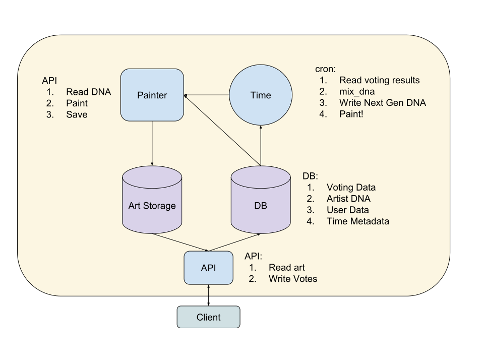

# Artist 2D Technical Design Doc

status: DRAFT

## Overview

Artest 2D generates abstract 2D art immitating an artist (brush strokes) and making "decisions"
based on "DNA". The better the art, the higher the chance that the DNA will make it to the next
generation.

## Server Architecture

