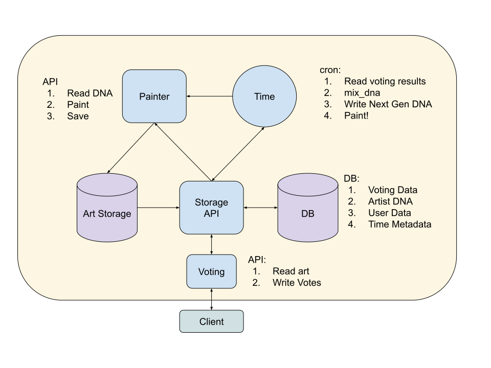

# Artist 2D Technical Design Doc

status: DRAFT

## Overview

Artest 2D generates abstract 2D art immitating an artist (brush strokes) and making "decisions"
based on "DNA". The better the art, the higher the chance that the DNA will make it to the next
generation.

## Server Architecture




## Time Cronjob

1. Close the polls: tally votes and write them to the db.
2. Mix DNA: Mix and match most popular artists' DNA to create the next generation nd write it to the
   db.
3. Paint: Tell the Painting API to paint.

## Painting API

`/paint`: GET.
    1. Get the latest/current generation of DNA from Storage API.
    2. For each new artist, paint their painting.
       * Save image to storage.
    3. Open to polls: Set current generation in Storage API.


## Voting API

`/art`: GET
    1. Read the current generation of art.
    2. Return list of all art for the current generation.

`/heart`: POST
    1. auth user
    2. Record a heart for this artist for this user.

`/heart`: DELETE
    1. auth user
    2. Remove a heart for this artist for this user.


## STORAGE API

`/art`: GET
    1. Read the current generation of art.
    2. Return list of all art for the current generation.


1. Write voting results for a generation.
1. Get DNA, default to current generation.
2. Write DNA.
3. Get art, default to current generation.

## Database

All databases should have metadata:
```
created_date
updated_date
deleted_date
```

```
Heart:
    id: pk, uuid
    paiting_id: fk
    user_id: fk
constraint: unique(painting_id, user_id)

Dna:
    artist_id: pk, uuid
    generation: fk
    dna: varchar
    hearts: number, total hearts in it's active time.

Generation:
    id: pk, inc_number
    active_date: timestamp, the datetime it went active for hearting.
    inactive_date: timestamp, the datetime it went inactive for hearting.

Time:
    current_art_generation: fk(Generation)
    current_dna_generation: fk(Generation)
    generation_length_s: number
```
